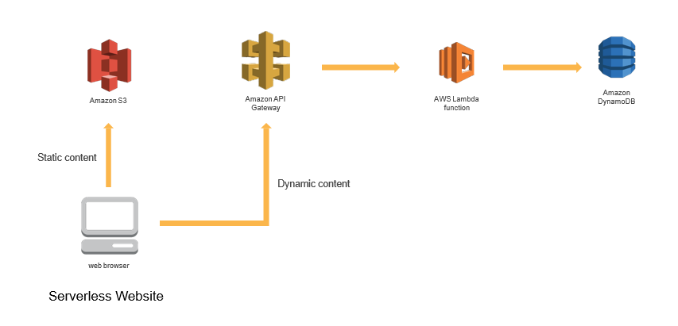
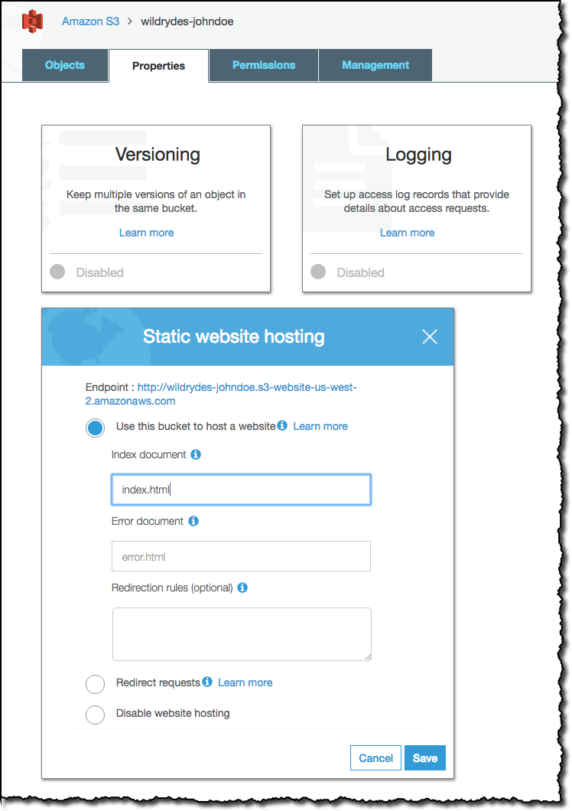

# UNITHON 5th 서버리스 데모 가이드

이 문서는 Amazon S3, AWS Lambda, Amazon API Gateway, Amazon DynamoDB 및 기타 서비스를 사용하여 서버리스 To-Do 응용 프로그램을 구축하는 과정을 안내하는 워크샵 가이드와 자료들을 제공합니다.

전체 아키텍처의 그림은 아래 다이어그램을 참조하십시오.



# S3 Static Web Hosting

### 1. S3 버킷 생성

콘솔 또는 AWS CLI를 사용하여 Amazon S3 버킷을 생성하십시오. 버킷의 이름은 전 세계적으로 고유해야합니다. `unithon-yourname`와 같은 이름을 사용할것을 권장합니다.

<details>
<summary><strong>단계별 지침 (자세한 내용을 보려면 펼쳐주세요)</strong></summary><p>

1. AWS Management Console에서 **Services** 를 선택한 다음 **S3** 를 선택하십시오.

1. **+Create Bucket** 을 선택하십시오.

1. `unithon-yourname`와 같은 전 세계적으로 고유한 이름을 설정하십시오.

1. 드롭다운 메뉴에서 이 실습에서 사용할 리전을 선택하십시오.

1. 설정을 복사할 버킷을 선택하지 않고 대화상자의 왼쪽 하단에 있는 **Create** 를 선택하십시오.

</p></details>

### 2. 콘텐츠 업로드

    https://github.com/hyunmin-mz/unithon-serverless/blob/master/files/demo.zip

위 경로에서 demo.zip 압축파일을 다운로드 한 다음 압축을 풀고, 폴더 안에 있는 index.html 파일을 사용자가 생성한 버킷에 업로드해서 이용하실수도 있습니다.

demo 압축파일을 풀고, index.html 파일을 방금전 생성한 S3 버킷에 업로드합니다.

### 3. 버킷 정책에 Public Reads 권한을 허용

익명 사용자가 사이트를 볼 수있게하려면 버킷 정책을 새 Amazon S3 버킷에 추가해야합니다. 기본적으로 버킷은 AWS 계정에 대한 액세스 권한이있는 인증 된 사용자 만 액세스 할 수 있습니다.

부여할 정책에 대한 설정은 [이 예제](http://docs.aws.amazon.com/AmazonS3/latest/dev/example-bucket-policies.html#example-bucket-policies-use-case-2) 를 참고하십시오. 익명 사용자에 대한 읽거 전용 액세스. 이 예제 정책은 인터넷상의 모든 사용자가 귀하의 콘텐츠를 볼 수있게합니다. 버킷 정책을 업데이트하는 가장 쉬운 방법은 콘솔을 사용하는 것입니다. 버킷을 선택하고 권한(Permissions) 탭을 선택한 다음 버킷 정책(Bucket Policy)을 선택하십시오.

<details>
<summary><strong>단계별 지침 (자세한 내용을 보려면 펼쳐주세요)</strong></summary><p>

1.  S3 콘솔에서 섹션 1에서 생성 한 버킷의 이름을 선택하십시오.

1. **Permissions** 탭을 선택한 다음, **Bucket Policy**를 선택하십시오.

1. 다음 정책 문서를 버킷 정책 편집기에 입력하고 `YOUR_BUCKET_NAME` 을 여러분이 생성한 버킷 이름으로 변경하십시오.

    ```json
    {
        "Version": "2012-10-17",
        "Statement": [
            {
                "Effect": "Allow",
                "Principal": "*",
                "Action": "s3:GetObject",
                "Resource": "arn:aws:s3:::YOUR_BUCKET_NAME/*"
            }
        ]
    }
    ```

1. **Save** 버튼을 선택하여 새 정책을 적용하십시오.

</p></details>

### 4. 웹 사이트 호스팅 활성화

콘솔을 사용해서 정적 웹사이트 호스팅을 활성화합니다. 버킷을 선택한 후에 속성탭에서 이 작업을 수행할 수 있습니다. index document로 `index.html` 을 설정하고, error document는 비워두십시오. 자세한 내용은 [정적 웹 사이트 호스팅을 위한 버킷 구성](https://docs.aws.amazon.com/AmazonS3/latest/dev/HowDoIWebsiteConfiguration.html) 의 설명서를 참고하십시오.

<details>
<summary><strong>단계별 지침 (자세한 내용을 보려면 펼쳐주세요)</strong></summary><p>

1. S3 콘솔의 버킷 세부 사항 페이지에서, **Properties** 탭을 선택하십시오.

1. **Static website hosting** 을 선택하십시오.

1. **Use this bucket to host a website** 을 선택하고, index document에 `index.html`를 입력하십시오. 다른 입력칸은 비워둡니다.

1. 먼저 **Endpoint** URL 을 확인하십시오. 그 뒤에 **Save** 버튼을 클릭하십시오. 이 URL을 나머지 실습에서 웹 응용 프로그램을 볼 때 사용할 것입니다. 여기에서 이 URL을 귀하의 웹 사이트의 기본 URL이라고 합니다.

1. **Save**을 클릭하여 변경 사항을 저장하십시오.

    

</p></details>
